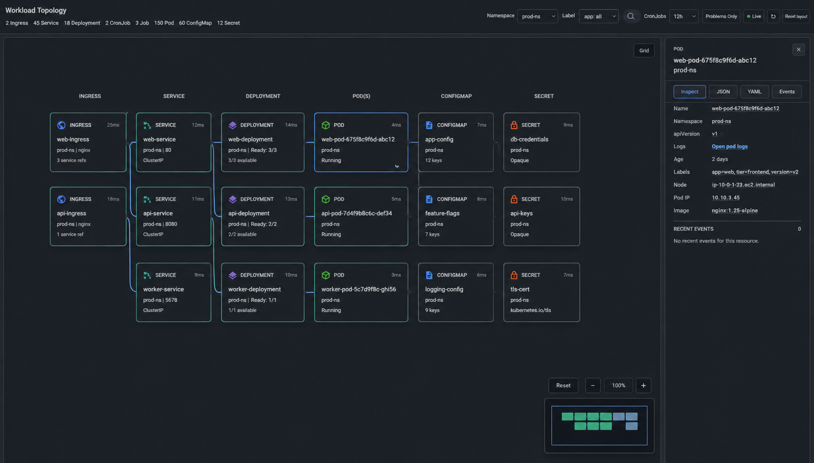
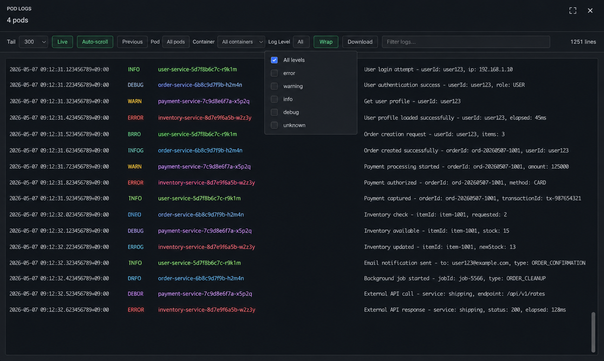

# Freelens Workload Topology

[](https://github.com/agent-jeong/freelens-workload-topology/releases) [](LICENSE)

[한국어](README.ko.md)

A Kubernetes topology extension for [FreeLens](https://github.com/freelensapp/freelens). It adds a **Workload Topology** page to the cluster view, visualizing resource relationships, real-time status, metrics, and pod logs in a single interactive graph.

Instead of jumping between Ingress, Service, Deployment, Pod, ConfigMap, and Secret detail screens, Workload Topology renders all connections as a navigable graph you can inspect at a glance.

## Preview






## Why Workload Topology

Kubernetes relationships are spread across dozens of screens. This extension brings them together so you can answer questions like:

- Which Service is this Ingress routing to, and is the backend healthy?
- Which Pods belong to this Deployment, and what is their CPU/memory usage?
- Which ConfigMaps and Secrets does this workload reference?
- What is the blast radius if this resource fails?
- Why is this Pod in CrashLoopBackOff, and what do the events say?

## Supported Apps

| App | Version |
|---|---|
| FreeLens | 1.6.0+ |

The extension uses the FreeLens renderer API and requires no extra sidecar or cluster agent.

## Core Features

### Topology Graph
- Resource graph for **Ingress, Service, Deployment, CronJob, Job, Pod, ConfigMap, Secret**
- Automatic edge detection via Ingress backends, Service selectors, Deployment selectors, OwnerReferences, and Pod volume/env references
- Status indicators: `healthy`, `warning`, `danger`, `unknown`
- Namespace-aware browsing with per-namespace layout persistence
- CronJob/Job time-window filter (1h, 24h, 7d)
- Group cards for Pods and Jobs with expand/collapse

### Inspection & Debugging
- **Detail panel** with resource summary, related Kubernetes Events, and JSON tree search
- **YAML editor** with live diff, apply warnings, and direct Kubernetes API update
- **Pod logs** with Live tail, previous logs, container filter, severity filter, keyword search, line wrap, duplicate hiding, and adaptive virtual scrolling
- **AI analysis prompt** copy with auto-masked secrets (no external API calls)
- **Blast radius** analysis to visualize the failure impact of a selected resource

### Real-time Monitoring
- **Live mode** with 4-second auto-refresh cycle and auto-scroll toggle
- **Metrics-server integration** showing real-time CPU and memory usage per Pod
- **Issue panel** with quick-jump to warning/danger resources and event-based cause hints
- **Live notifications** for resource status changes

### Navigation & Interaction
- Canvas pan, zoom, minimap, and grid toggle
- Drag nodes to rearrange; Shift+drag to multi-select
- Edge hover highlighting and clickable resource cards
- Right-click context menu for quick actions
- Label-based filtering

### Keyboard Shortcuts

| Key | Action |
|---|---|
| `?` | Toggle keyboard shortcut help |
| `⌘K` | Search resources |
| `⌘G` | Toggle grid background |
| `⌘L` | Toggle Live mode (auto-refresh) |
| `⌘.` | Refresh resources |
| `⌘P` | Toggle Problems Only filter |
| `-` / `+` | Zoom out / Zoom in |
| `0` | Reset zoom & position |
| `Delete` | Reset selected node position |
| `Esc` | Close / Deselect |
| `Shift+Drag` | Multi-select (marquee) |
| `Right-click` | Context menu |

## Installation

### Install from GitHub Releases

1. Open the [latest release](https://github.com/agent-jeong/freelens-workload-topology/releases/latest).
2. Download the `.tgz` asset.
3. Open FreeLens and go to the **Extensions** screen.
4. Install the downloaded `.tgz` file.

### Build from Source

```shell
corepack pnpm install
corepack pnpm build
corepack pnpm pack
```

Then install the generated `freelens-workload-topology-1.0.0.tgz` from the Extensions screen.

## Usage

1. Open a cluster in FreeLens.
2. Open **Workload Topology** from the cluster page menu.
3. Select a namespace.
4. Explore the topology graph — hover edges, click cards, drag nodes.
5. Use the detail panel to inspect YAML, events, and logs.
6. Press `?` to view all keyboard shortcuts.

## Metrics Server

To display real-time CPU and memory usage on Pod tooltips, the cluster needs a running [metrics-server](https://github.com/kubernetes-sigs/metrics-server).

This extension does not install or modify cluster-wide metrics components. In production clusters, ask the cluster administrator to verify the metrics-server deployment, APIService status, RBAC, and cluster security policy.

If metrics-server is not available, the topology continues to work normally without CPU/memory data.

## Project Structure

```
src/
  main/index.ts                         # FreeLens main extension entry point
  renderer/index.tsx                    # Minimal renderer entry / page registration
  renderer/pages/WorkloadTopologyPage.tsx
                                       # Main topology page and cluster interactions
  renderer/components/                  # UI components (cards, detail panel, pod logs, minimap, etc.)
  renderer/topology/                    # Topology graph building, status, problems, edges
  renderer/utils/                       # Formatting, kube helpers, events, YAML/JSON/AI utilities
  renderer/types.ts                     # Shared renderer types
  renderer/constants.ts                 # Shared layout and UI constants
  renderer/styles.ts                    # Extension UI styles
electron.vite.config.ts  # Build configuration
package.json             # Extension metadata and scripts
```

At the moment, `src/renderer/index.tsx` is intentionally small (entry-only), while most implementation lives under `pages/`, `components/`, `topology/`, and `utils/`.

## Development

```shell
corepack pnpm install
corepack pnpm build
```

| Command | Description |
|---|---|
| `pnpm build` | Production build |
| `pnpm type:check` | TypeScript type checking |
| `corepack pnpm pack` | Create installable `.tgz` package |

## Notes

- YAML apply removes `status` and `metadata.managedFields` before editing. Changes to `kind`, `metadata.name`, `metadata.namespace`, and Pod immutable fields will be rejected by the Kubernetes API.
- AI analysis prompt copy does not call any external API. Secret data, env values, and token/password/key fields are automatically masked.
- Pod log modal displays up to 24 log streams at once.
- If the Event API is unavailable, the event panel shows empty and topology loading continues normally.

## Contributing

Issues and pull requests are welcome.

When reporting bugs, please include:

- FreeLens version
- Kubernetes cluster version and provider
- Screenshot or short GIF when possible

## License

MIT
